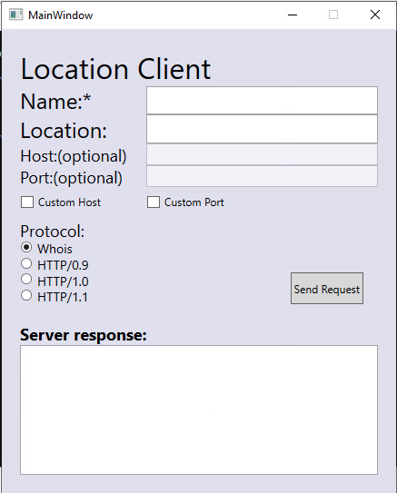

# TCP C# Client with UI
This project is based on my [previous](https://github.com/geriszter/location.git) TCP client, but with an additional user interface.

# Usage
When launched with no arguments, it opens an interactive interface.

